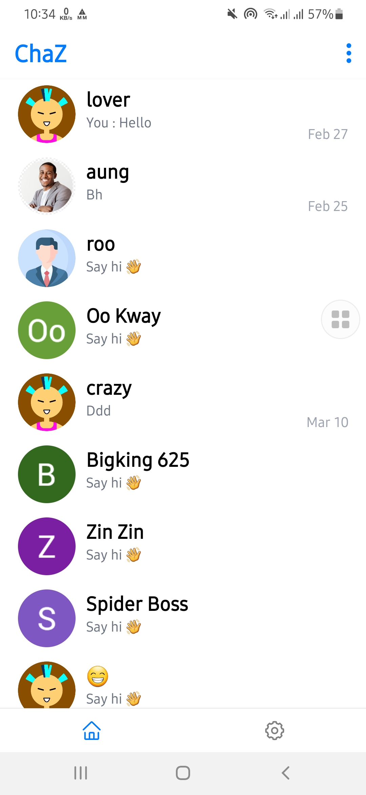
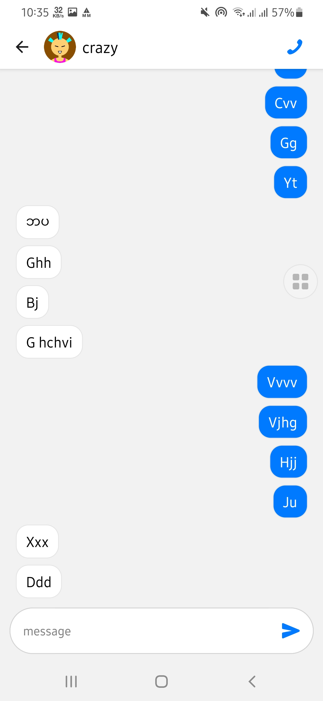
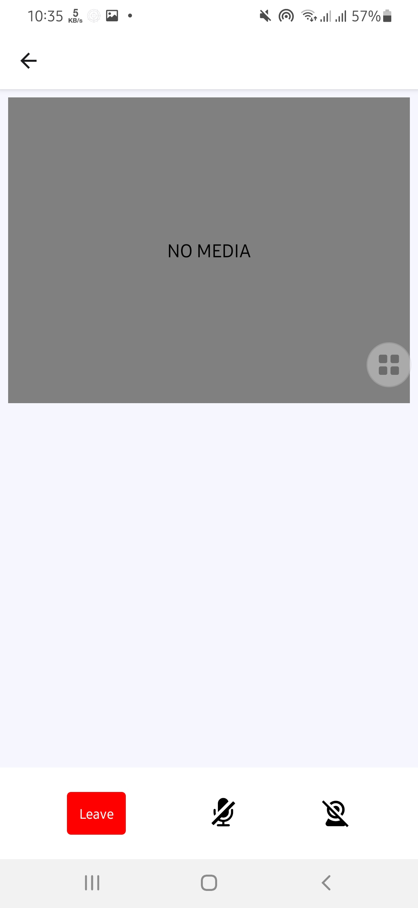
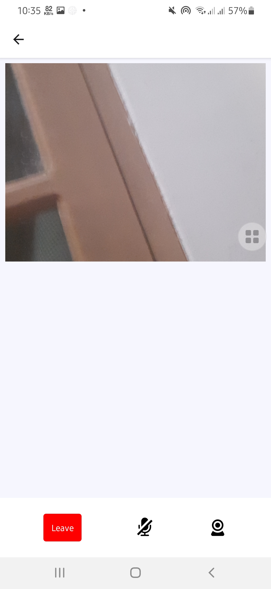

# Minimal chat app

## Demos

<!-- 

 -->

<table>
  <tr>
    <td valign="top"></td>
    <td valign="top"></td>
    <td valign="top"></td>
    <td valign="top"></td>
  </tr>
</table>

### Download apk

https://expo.dev/artifacts/eas/qkhtehiWHerXG7NDVQ87FP.apk

## Tech stack

- React Native
- Expo
- Firebase
- VideoSdk
- Nativewind
- React Navigation

## Features

- Google auth, Password reset
- Live Notification
- Video call
- Profile

## Usage

- Create firebase project and download `google-services.json`
- add `google-services.json` to `android/app` folder
- run `cp .env.example .env`
- run `npm install`
- run `eas build`

## Note

Only available for android currently :-(
