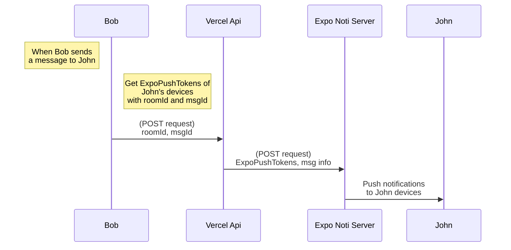

# Chaz

A feature-rich react native chat application designed for seamless and real-time communication. The app supports multiple functionalities such as instant messaging, video calling, and personalized profiles, providing a user-friendly and interactive experience.

## Demos

<table>
  <tr>
    <td valign="top"></td>
    <td valign="top"></td>
    <td valign="top"></td>
    <td valign="top"></td>
  </tr>
</table>

### Demo Video
https://youtu.be/eAF7teXrRVw?si=sK1NOlFwvMRUW4NU

### Download apk

https://drive.google.com/file/d/1LmfkDXhVcBwL5nnau9K6_9coyEnO6IC0/view?usp=sharing

## Technologies Used

- **Frameworks and Libraries :**
	- React Native
	- Expo
	- Nativewind
	- React Navigation
	- Expo Router
	- Lottie (for animations)
	- Expo Packages (various)
	- Typescript

- **Backend and Database**: Firebase services, Firestore
- **Third-Party Services**: VideoSDK

- **Development Tools**:
  - Expo Go

## Features
  - Google Authentication
  - Password Reset
  - Push Notifications
  - Video And Audio Calls
  - User Profiles
  >Note : Only available for android currently

## Implementations
-   **Navigation**: Implemented using Expo Router's tab and stack navigation for seamless routing.
-  **Video and Audio Calls**: Enabled using VideoSDK for real-time communication.
-   **Authentication**: Implemented email and Google authentication using Firebase Auth.
-   **Database**: Used Firestore for real-time, cloud-based data storage.
-   **Password Reset**: Built a forgot password feature using Firebase Auth.
- **Push Notifications**: Implemented using Expo Push Notifications with a Vercel serverless API for real-time updates.
-   **Animations**: Used Lottie for loading animations.
-   **Development**: Used Expo Go for development on mobile devices.

## Challenges

-   **Build Process**: Faced challenges with EAS builds and local build configurations.
-   **Security**: Used Expo Secure Store for environment variables.
-   **Push Notification Challenges**: First time using Expo Push Notifications, faced learning curve in setup and configuration.
-   **Notification System**: Faced challenges implementing a secure notification system using Expo Push Notifications.
-   **Responsive Design**: Ensured responsive design across devices for user experience.

## Secure Push Notification System

## Installation
- Create firebase project and download `google-services.json`
- add `google-services.json` to `android/app` folder
- uncomment `android/app/google-services.json` in .gitignore
- run `cp .env.example .env`
- run `npm install`
- run `eas build`

## License

This project is licensed under the MIT License. See the  `LICENSE`  file for details.
